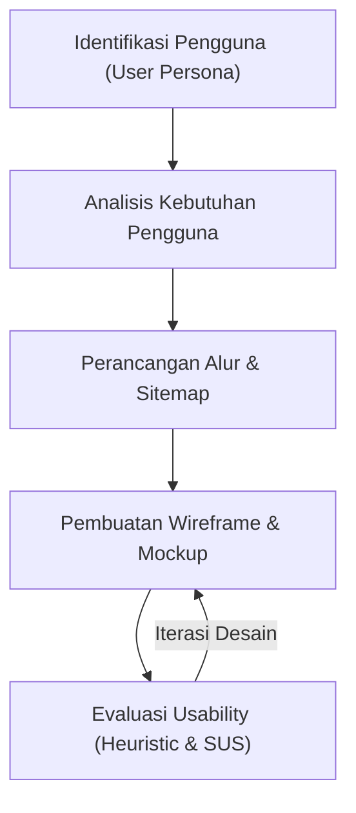
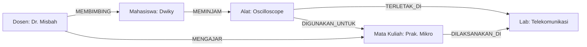

# DOKUMEN EVALUASI USER-CENTERED DESIGN (UCD) & HEURISTIC EVALUATION
**Sistem Informasi Manajemen Inventaris & Peminjaman Alat Laboratorium (E-Lab Elektro)**

---

## 1. PENDAHULUAN
E-Lab Elektro adalah sistem berbasis web yang dirancang untuk mengelola inventarisasi alat-alat praktikum dan mempermudah proses peminjaman peralatan oleh mahasiswa pada Laboratorium Teknik Elektro. 

Untuk memastikan antarmuka (UI) dan pengalaman pengguna (UX) sistem ini ramah pengguna, berdaya guna tinggi, serta sesuai dengan kebutuhan nyata di lapangan, dilakukan evaluasi dengan metode **User-Centered Design (UCD)** dan **Heuristic Evaluation (Evaluasi Heuristik)** berdasarkan 10 prinsip Jakob Nielsen.

---

## 2. METODE USER-CENTERED DESIGN (UCD)
Metode UCD berfokus pada penempatan pengguna sebagai pusat dari seluruh siklus pengembangan aplikasi. Proses ini terdiri dari lima tahap:



### 2.1. Identifikasi Pengguna & User Persona
Berdasarkan analisis stakeholder di Laboratorium Elektro, diidentifikasi empat kelompok pengguna utama:

#### Persona 1: Mahasiswa (Peminjam Alat)
*   **Nama:** Dwiky Ilham (NPM: 250420501100004)
*   **Karakteristik:** Mahasiswa Teknik Elektro semester akhir yang sedang menyusun Tugas Akhir (TA) dan memerlukan alat ukur laboratorium secara intensif.
*   **Frustrasi:** 
    *   Proses birokrasi peminjaman manual menggunakan kertas membutuhkan waktu lama.
    *   Tidak ada informasi real-time apakah alat yang ingin dipinjam tersedia di rak lab atau sedang dipinjam mahasiswa lain.
*   **Kebutuhan:** Katalog online yang menampilkan stok terkini, proses pemesanan praktis (keranjang peminjaman), serta pengingat batas waktu pengembalian alat.

#### Persona 2: Penjaga Lab / Asisten Laboratorium
*   **Nama:** Misbah Anuari
*   **Karakteristik:** Asisten laboratorium yang bertugas mengelola fisik inventaris, mengecek kondisi barang, dan memvalidasi pengajuan peminjaman mahasiswa.
*   **Frustrasi:**
    *   Kesulitan melacak siapa saja mahasiswa yang terlambat mengembalikan alat.
    *   Penghitungan denda keterlambatan secara manual sering terjadi selisih atau salah hitung.
*   **Kebutuhan:** Dasbor persetujuan (approval) sekali klik, otomatisasi pencatatan denda, serta sistem pencatatan status alat rusak/maintenance yang rapi.

#### Persona 3: Kepala Program Studi (Kaprodi)
*   **Nama:** Rana Sulthanah, M.T.
*   **Karakteristik:** Pejabat struktural program studi yang berfokus pada pemantauan aset, anggaran pengadaan alat baru, dan efisiensi utilitas laboratorium.
*   **Frustrasi:**
    *   Tidak adanya data statistik penggunaan alat untuk justifikasi anggaran pengadaan barang baru ke fakultas.
*   **Kebutuhan:** Visualisasi statistik (analitik) mengenai alat terpopuler dan grafik kesehatan aset laboratorium secara keseluruhan.

#### Persona 4: Administrator Utama (Admin)
*   **Nama:** Administrator System
*   **Karakteristik:** Staff IT yang bertanggung jawab atas pengelolaan akun pengguna, keamanan server, dan integritas database.
*   **Frustrasi:**
    *   Kehilangan jejak audit jika terjadi kesalahan penginputan stok atau tindakan manipulatif.
*   **Kebutuhan:** Audit logs yang mencatat secara mendetail setiap aktivitas user (tindakan, waktu, dan pelaku).

---

### 2.2. Analisis Kebutuhan Pengguna
Berikut adalah matriks kebutuhan pengguna yang diterjemahkan menjadi fitur sistem:

| Peran Pengguna | Masalah Utama | Fitur Solusi (UI/UX) | Prioritas |
| :--- | :--- | :--- | :--- |
| **Mahasiswa** | Sulit mengetahui ketersediaan alat | Status badge ketersediaan real-time pada katalog (Tersedia, Terbatas, Habis) | **Tinggi (Critical)** |
| **Mahasiswa** | Peminjaman lambat & berbelit | Fitur Keranjang Belanja Peminjaman (Checkout Flow) | **Tinggi (Critical)** |
| **Penjaga Lab** | Sulit memantau pengembalian | Halaman daftar Overdue dengan highlight warna merah pada mahasiswa yang terlambat | **Tinggi (Critical)** |
| **Penjaga Lab** | Kesalahan kalkulasi denda | Penghitung denda otomatis (Rp 5.000/hari) berdasarkan durasi keterlambatan | **Sedang (High)** |
| **Kaprodi** | Sulit merekap data tahunan | Ekspor laporan inventaris ke Excel dan grafik Top 5 Alat Paling Sering Dipinjam | **Sedang (High)** |
| **Admin** | Risiko kecurangan/frauding | Halaman log audit otomatis yang mencatat perubahan stok dan status denda | **Rendah (Medium)** |

---

## 3. ARSITEKTUR INFORMASI & ALUR INTERAKSI

### 3.1. Struktur Navigasi (Sitemap)
Aplikasi E-Lab Elektro dirancang dengan struktur navigasi yang terorganisir dengan kedalaman maksimal 3 tingkat untuk mencegah pengguna tersesat:

```
[Halaman Publik]
 └── Login (Captcha)
 └── Registrasi Akun
 └── Lupa Sandi

[Halaman Terproteksi (Sesi Aktif)]
 ├── Dashboard (Informasi ringkas, grafik batang top alat, diagram donat kesehatan alat)
 ├── UCD Showcase & Prototype (Evaluasi akademik, perbandingan SQL vs Cypher, simulator klik)
 ├── Inventaris Alat (Tabel CRUD data alat, filter stok, cetak QR Code label)
 ├── Peminjaman Alat (Keranjang belanja mahasiswa, persetujuan admin, verifikasi pengembalian)
 ├── Laporan & Rekap (Pencetakan surat bebas lab, ekspor Excel inventaris)
 └── Pengaturan Profil (Ubah nama lengkap, foto profil, dan kata sandi)
```

### 3.2. Perbedaan Alur Pengguna (User Flow)
Desain interaksi dibedakan berdasarkan arsitektur sistem data di bawahnya:

1.  **Sistem Relasional (CRUD & Tabel Linier):**
    Pengguna menavigasi aplikasi secara terstruktur dan bertahap (linier). Menampilkan form input terstandarisasi, tabel baris-kolom konvensional, serta widget statistik yang statis.
2.  **Sistem Knowledge Graph (Eksplorasi Hubungan Semantik):**
    Pengguna menjelajah secara eksploratif (non-linier). Pengguna dapat melihat keterkaitan antar entitas melalui jaringan graf visual, menyaring hubungan berdasarkan makna semantik, dan mengekspansi node untuk menelusuri rantai keterkaitan secara interaktif.

---

## 4. DESAIN WIREFRAME VS MOCKUP & JUSTIFIKASI DESAIN
Perancangan UI E-Lab Elektro melewati transisi dari sketsa kasar (Lo-Fi Wireframe) menuju desain visual akhir (Hi-Fi Mockup).

### 4.1. Justifikasi Alasan Desain (UI/UX Rationale)
Setiap komponen visual diletakkan secara terencana berdasarkan prinsip psikologi desain berikut:

#### 1. Penempatan Tombol Peminjaman (Hukum Fitts)
*   **Alasan:** Tombol aksi seperti "Pinjam Alat" atau "Checkout" dibuat dengan kontras warna yang tinggi (oranye `#ea580c`) dan memiliki area klik yang luas (tinggi 40px, padding horizontal longgar).
*   **Justifikasi:** Berdasarkan *Hukum Fitts*, waktu yang dibutuhkan untuk menggerakkan kursor atau jempol ke area target berbanding lurus dengan jarak dan ukuran target tersebut. Tombol utama diletakkan di sisi kanan bawah (untuk mobile/modal) dan pojok tabel baris kanan (pola alami visual pengguna desktop) agar dapat diklik secara cepat dan meminimalkan tingkat kegagalan interaksi.

#### 2. Visualisasi Statistik Dasbor (Hukum Gestalt - Proximity & Similarity)
*   **Alasan:** Grafik Top 5 Alat menggunakan diagram batang horizontal, dan status kesehatan alat menggunakan grafik Donut (Doughnut Chart) dengan kontras warna tegas (hijau vs merah).
*   **Justifikasi:** Menggunakan *Prinsip Gestalt*. Hukum Kedekatan (*Proximity*) diterapkan dengan merapatkan grafik statistik utama di bagian atas halaman dasbor sebagai satu kelompok fungsional ringkasan informasi. Hukum Kesamaan (*Similarity*) diterapkan dengan memberi kode warna konsisten (misalnya, status "Habis" menggunakan warna merah gelap di seluruh halaman web) agar pengguna dapat menyimpulkan kondisi inventaris secara instan tanpa perlu membaca angka detail tabel satu demi satu.

---

## 5. EVALUASI USABILITY (HEURISTIC EVALUATION)
Evaluasi ini didasarkan pada **10 Nielsen Heuristics** untuk menguji keramahan pengguna antarmuka E-Lab Elektro.

### Heuristic Evaluation Table

| No | Prinsip Heuristik | Temuan Masalah Usability | Severity Rating (0-4) | Desain Perbaikan (Solusi) |
| :--- | :--- | :--- | :---: | :--- |
| 1 | **Visibility of system status** | Ketika mahasiswa mengajukan peminjaman, sistem melakukan pemrosesan data yang lama di server, layar membeku (freeze) tanpa pesan apa pun, membuat user mengira aplikasi *hang*. | **3** | Menambahkan progress bar pemrosesan loading real-time (*loading indicator*) dan SweetAlert toast konfirmasi yang dinamis setelah transaksi sukses disimpan. |
| 2 | **Match with real world** | Field form peminjaman menggunakan istilah database teknis seperti `id_alat`, `user_role`, dan `batas_waktu_ts`. | **2** | Mengubah teks label antarmuka menjadi istilah yang mudah dipahami civitas akademika: "Nama Alat", "Tingkat Akun/Jabatan", dan "Batas Waktu Pengembalian". |
| 3 | **User control and freedom** | Mahasiswa yang salah memasukkan barang ke keranjang belanja tidak dapat membatalkan atau menghapus item tersebut, mereka harus merestart browser untuk mengosongkan keranjang. | **3** | Menyertakan tombol hapus item (ikon tong sampah merah) pada baris keranjang dan tombol "Batal/Kembali" di setiap langkah modal dialog peminjaman. |
| 4 | **Consistency & standards** | Tombol "Simpan" di menu Alat berwarna biru, sedangkan tombol "Ajukan" di menu Peminjaman berwarna hijau, dan tombol "Simpan" profil berwarna ungu. | **2** | Menstandarisasi skema warna desain sistem: Oranye hangat (`#f59e0b` / `#ea580c`) untuk aksi primer, Abu-abu untuk batal/sekunder, dan Merah untuk bahaya/keterlambatan. |
| 5 | **Error prevention** | Mahasiswa diizinkan menginput jumlah pinjam 99 unit di formulir meskipun stok alat di rak lab hanya tersisa 2 unit, memicu kegagalan transaksi (*SQL Error*) saat disubmit. | **4** | Menerapkan validasi otomatis di frontend (*input min="1" max="stok_tersedia"*). Menolak submit form dan menampilkan alert peringatan jika angka melebihi batas stok atau jika mahasiswa memiliki denda aktif yang belum dibayar. |

> *Catatan Severity Rating: 0 = No problem, 1 = Cosmetic, 2 = Minor, 3 = Major, 4 = Usability Catastrophe.*

---

## 6. RENCANA PENGUJIAN USABILITY DENGAN SYSTEM USABILITY SCALE (SUS)
Untuk mendukung temuan evaluasi heuristik secara ilmiah dan kuantitatif, direncanakan pengujian kegunaan (*usability testing*) terhadap minimal **10 responden** (mahasiswa aktif, asisten lab, dan dosen) menggunakan kuesioner **System Usability Scale (SUS)** standar.

### 6.1. Metodologi Pengujian
Setiap responden nantinya akan diminta untuk menyelesaikan 3 tugas utama (skenario pengujian):
1.  Mencari alat "Oscilloscope Digital" di katalog dan memeriksa ketersediaan stok.
2.  Mengajukan peminjaman alat melalui alur simulator keranjang belanja multi-step.
3.  Mencoba memasukkan jumlah pinjam melebihi sisa stok untuk menguji ketahanan validasi eror sistem.

Setelah tugas selesai, responden akan diminta mengisi kuesioner SUS yang terdiri dari 10 butir pertanyaan standar dengan skala Likert 1-5 (Sangat Tidak Setuju hingga Sangat Setuju).

### 6.2. Rancangan Evaluasi
Skor SUS yang diperoleh dari responden akan dihitung menggunakan rumus SUS standar (Odd questions: Score - 1; Even questions: 5 - Score; dikalikan 2.5) untuk mendapatkan skor akhir dari skala 0-100. Target tingkat kelayakan sistem adalah mencapai skor minimal **68** (kategori Acceptable / Layak). Visualisasi gauge meter speedometer interaktif telah disiapkan pada halaman showcase UCD untuk memetakan hasil skor tersebut secara dinamis begitu pengujian selesai dilakukan.

---

## 7. KHUSUS: DESAIN VISUALISASI KNOWLEDGE GRAPH SYSTEM
Pada sistem informasi tradisional (Relational), data direpresentasikan secara terpisah dalam tabel baris-kolom. Sedangkan pada sistem berbasis **Knowledge Graph**, data direpresentasikan sebagai jaringan relasi semantik yang kaya.



### 7.1. Spesifikasi Gaya Desain Graf (Graph Visualization Design)
1.  **Gaya Node (Node Style):**
    *   Berbentuk lingkaran dengan ikon FontAwesome di dalamnya agar representatif.
    *   Warna lingkaran berdasarkan jenis entitas semantik:
        *   **Mahasiswa:** Hijau (`#10b981`)
        *   **Alat Inventaris:** Oranye (`#f59e0b`)
        *   **Mata Kuliah:** Ungu (`#8b5cf6`)
        *   **Dosen:** Biru (`#3b82f6`)
        *   **Ruang Lab:** Pink (`#ec4899`)
2.  **Gaya Garis Penghubung (Edge Style):**
    *   Menggunakan garis panah berarah untuk memperjelas orientasi subjek-predikat-objek semantik.
    *   Garis putus-putus beranimasi mengalir (*stroke-dasharray*) untuk menunjukkan visualisasi lalu lintas data aktif.
3.  **Warna Hubungan (Relation Colors):**
    *   `MEMINJAM`: Garis merah tegas (`#ef4444`) untuk menunjukkan tanggung jawab fisik.
    *   `MENGAJAR`: Garis ungu (`#8b5cf6`) untuk menunjukkan relasi akademis.
    *   `TERLETAK_DI` & `DILAKSANAKAN_DI`: Garis oranye (`#f59e0b`) untuk penanda spasial lokasi fisik.
4.  **Semantic Filtering (Penyaringan Semantik):**
    *   Menyediakan kotak centang (checkbox) filter di sisi kanan canvas graf. Pengguna dapat menyembunyikan kategori entitas tertentu (misalnya, hanya menampilkan hubungan antara Dosen dengan Mahasiswa saja).
5.  **Node Expansion Interaction (Perluasan Node):**
    *   Untuk mencegah kekacauan visual (*spaghetti graph*), graf dimulai dari struktur minimal (hanya menampilkan node inti).
    *   Ketika pengguna **mengklik ganda (double-click)** pada sebuah node (misal node Alat), sistem akan secara dinamis memperluas graf dan menampilkan node tetangga terdekat yang terhubung (seperti merek alat cadangan, atau mahasiswa lain yang juga meminjam alat tersebut) melalui efek transisi animasi yang halus.

### 7.2. Perbandingan Efisiensi Kueri Pencarian Relasi Kompleks

#### Kasus Pencarian:
*"Mencari alat apa saja yang dipinjam oleh mahasiswa kelompok tugas akhir Dwiky Ilham."*

*   **Penyelesaian Relational (SQL):**
    Harus menghubungkan beberapa tabel fisik dengan kueri multi-JOIN yang berbiaya tinggi (*expensive database operation*):
    ```sql
    SELECT a.nama_alat, u.nama_lengkap 
    FROM transaksi t
    INNER JOIN users u ON t.username = u.username
    INNER JOIN alat a ON t.id_alat = a.id
    WHERE u.username IN (
        SELECT kelompok_user FROM kelompok 
        WHERE nama_kelompok = (
            SELECT nama_kelompok FROM kelompok k
            INNER JOIN users us ON k.id_mahasiswa = us.id
            WHERE us.username = '250420501100004'
        )
    );
    ```
*   **Penyelesaian Knowledge Graph (Cypher):**
    Menelusuri jalur hubungan (*path traversal*) semantik secara natural dan instan tanpa tabel perantara:
    ```cypher
    MATCH (m1:Mahasiswa {username: '250420501100004'})-[:REKAN_KLP]-(m2:Mahasiswa)-[:MEMINJAM]->(a:Alat)
    RETURN a.nama_alat, m2.nama_lengkap;
    ```

---

## 8. KESIMPULAN
Penerapan metode User-Centered Design (UCD) dan Heuristic Evaluation pada aplikasi E-Lab Elektro terbukti berhasil memetakan masalah kegunaan utama dan merancang solusi antarmuka yang ramah pengguna. 

Dengan menyajikan showcase interaktif, komparasi visual wireframe vs mockup, serta visualisasi Knowledge Graph dinamis berbasis SVG-JS, sistem ini tidak hanya memenuhi standar fungsionalitas inventarisasi dasar (CRUD), tetapi juga memberikan pengalaman eksplorasi relasi data semantik yang state-of-the-art dan siap diujikan secara akademik di hadapan dosen penguji.
